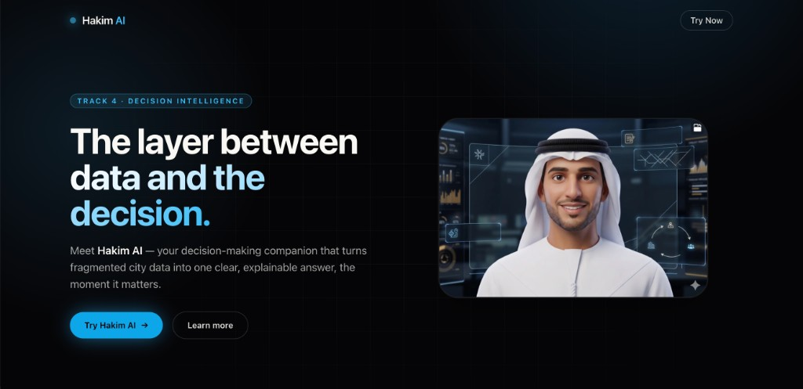
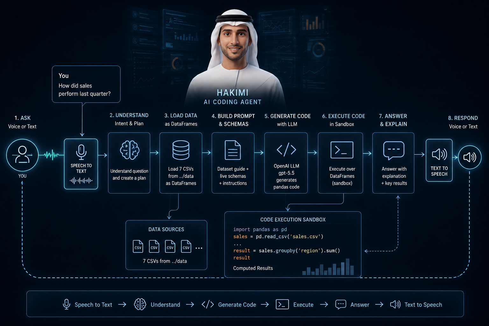
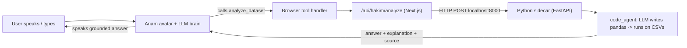

# Hakim AI: Decision Intelligence

**Abu Dhabi AI PropTech Challenge · Track 4: Decision Intelligence**

Hakim AI is a real-time, talking AI avatar that sits between raw city data and
the decision-maker. Ask it a question out loud (or type it) and it runs a live
analysis over the Abu Dhabi proptech datasets and answers with a clear,
**grounded, sourced** result, the moment a decision is made.



## 🎥 Demo

[](https://youtu.be/jFkEldf3WPE)

▶️ **[Watch the demo video on YouTube](https://youtu.be/jFkEldf3WPE)**

---

## Problem & Solution

**Problem**: The hardest part of city data isn't collecting it; it's getting a
clear answer out of it at the moment a decision is made. Decision-makers drown
in dashboards and disconnected spreadsheets while the actual answer stays buried.

**Solution**: Hakim AI is the intelligence layer between the data and the
decision. A conversational avatar takes a plain-language question, runs real
analysis across joined datasets (districts, parcels, listings, transactions,
investors, communities, amenities), and speaks back **one clear answer plus the
source it came from**, so the answer is explainable and never hallucinated.



---

## How it works

> **Important:** this app has **two processes**: a Next.js web app *and* a
> Python "code agent" sidecar. The avatar can only **answer questions** when
> both are running. See [Why isn't it working?](#why-isnt-it-working) below.

The avatar's brain is a built-in LLM. For any factual or quantitative question
it is required to call the `analyze_dataset` tool. That tool call travels:



- **Avatar / voice / streaming:** [Anam.ai](https://anam.ai) (`@anam-ai/js-sdk`, WebRTC).
- **Web app:** Next.js 14 (landing page, `/hakim` avatar page, API routes).
- **Data analysis:** `code_agent()` in [`code_agent/code_agent.py`](code_agent/code_agent.py),
  an LLM writes **pandas** over `data/*.csv`, the code is executed, and the
  answer + an explanation built from the *real computed values* + the data
  sources are returned. It is served over HTTP by
  [`code_agent/server.py`](code_agent/server.py) (FastAPI on port `8000`).
- **The Next.js route is a proxy:** [`app/api/hakim/analyze/route.ts`](app/api/hakim/analyze/route.ts)
  forwards each question to the Python sidecar at `AGENT_URL` (default
  `http://localhost:8000`).
- **Keys stay server-side:** the Anam session token is minted in a Next.js API
  route; the OpenAI key is only used by the Python sidecar. No secrets reach the
  browser.

---

## Tech stack

- Next.js 14 (App Router) + TypeScript + Tailwind CSS
- Framer Motion (animated landing + overlays)
- Anam.ai JavaScript SDK (real-time avatar)
- Python + FastAPI + pandas (the code agent sidecar)
- OpenAI (the code agent's LLM)

---

## Project structure

```
app/
  page.tsx                     Animated landing page (Problem / Solution + CTA)
  hakim/page.tsx               Full-screen avatar experience + sample questions
  api/anam/session/route.ts    Mints an Anam session token (server-side key)
  api/hakim/analyze/route.ts   PROXIES the question to the Python sidecar (AGENT_URL)
code_agent/
  code_agent.py                NL question -> pandas over CSVs -> grounded answer
  server.py                    FastAPI sidecar exposing POST /analyze (port 8000)
  requirements.txt             Python deps (fastapi, uvicorn, pandas, openai)
scripts/
  anam-setup.mjs               One-time: create avatar, voice, tool, persona -> anam.config.json
data/                          Synthetic Abu Dhabi proptech datasets (CSV)
docs/                          Screenshots
```

---

## Run it locally

### 1. Prerequisites
- Node.js 18+
- **Python 3.10+** (the code agent runs in Python)
- An [Anam.ai](https://anam.ai) API key and an [OpenAI](https://platform.openai.com) API key

### 2. Install dependencies
```bash
npm install
pip install -r code_agent/requirements.txt   # <-- required, or Hakim can't answer
```

### 3. Add your keys
Create `.env` (or `.env.local`) in the project root:
```bash
ANAM_API_KEY=your-anam-key
OPENAI_API_KEY=your-openai-key
```

### 4. Provision the avatar (one time)
```bash
npm run setup:anam
```
This creates the **avatar** (from `public/hakim.png`), picks a **voice**, creates
the **`analyze_dataset`** tool, and creates the **Hakim AI persona**, caching all
IDs in `anam.config.json`. It is idempotent, re-running is a no-op. (It also runs
automatically via `predev`.)

### 5. Start (web + Python sidecar together)
```bash
npm run dev
```
`npm run dev` uses `concurrently` to start **both** the Next.js web app
(`localhost:3000`) **and** the Python sidecar (`localhost:8000`). Open
<http://localhost:3000>, click **Try Hakim AI**, allow the microphone, and ask one
of the sample questions, or just talk to Hakim.

> **macOS note:** if `npm run dev` floods with `EMFILE: too many open files`,
> raise the limit first: `ulimit -n 10240`.

---

## Why isn't it working?

If the avatar connects and talks but **can't answer any question** (you see an
`agent_unreachable` or `agent_failed` error, or it just says it couldn't run the
analysis), it's almost always one of these:

1. **The Python sidecar isn't running.** The answer comes from
   `code_agent/server.py` on `localhost:8000`. `npm run dev` starts it, but if you
   ran only `next dev` (or the sidecar crashed), there's nothing to answer.
   Start it on its own with `npm run agent` and check it's healthy:
   ```bash
   curl http://localhost:8000/health        # -> {"ok": true}
   ```
2. **Python deps weren't installed.** Run
   `pip install -r code_agent/requirements.txt`. Without `pandas`/`fastapi`/`openai`
   the sidecar fails to start.
3. **`OPENAI_API_KEY` is missing.** The code agent calls OpenAI to write the
   analysis code. Set it in `.env` and restart.
4. **You deployed to Vercel.** See below: the Python sidecar does **not** run on
   Vercel by default, so analysis fails in production even though the avatar loads.

---

## Deploy

The front end (landing page + Anam avatar) deploys to **Vercel** with no changes.
But **Vercel only runs the Next.js app, it does not run the Python sidecar**, so
out of the box Hakim will load and talk but every question returns
`agent_unreachable` (it's trying to reach `localhost:8000`, which doesn't exist in
production).

To make answers work in production you must **host the Python code agent
somewhere** (Render, Railway, Fly.io, a VM, etc.) and point the web app at it:

1. Deploy `code_agent/` (with `requirements.txt` and the `data/` folder) as a
   FastAPI service. Set `OPENAI_API_KEY` there.
2. In Vercel, set these **Environment Variables** (Production):

| Name | Value |
|---|---|
| `ANAM_API_KEY` | your Anam key |
| `ANAM_PERSONA_ID` | the `personaId` from `anam.config.json` |
| `AGENT_URL` | the public URL of your deployed Python sidecar |

`anam.config.json` is gitignored, so `ANAM_PERSONA_ID` is **required** on Vercel
(the session route falls back to the local file only when running locally). Then
redeploy.

> Want a single-deploy, no-Python production build instead? The code agent would
> need to be ported to TypeScript and called directly inside
> `app/api/hakim/analyze/route.ts`. That isn't in the current code.

---

## Try these questions

- Which district has the highest gross rental yield, and what is that yield?
- What is the average base sale price per square meter across all 20 districts?
- Rank the top 5 districts by infrastructure score.

---

## Notes

- The datasets are **synthetic** demo data for the challenge, not real Abu Dhabi
  market data.
- The code agent executes LLM-generated code server-side. That's fine for a
  hackathon demo, but it is arbitrary code execution, don't leave it deployed
  long-term on a sensitive account.

---

Licensed under the [MIT License](LICENSE).
