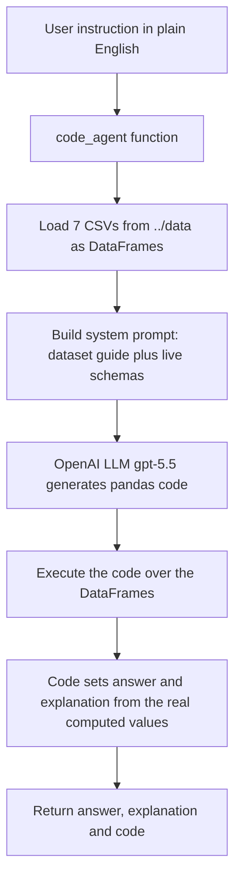
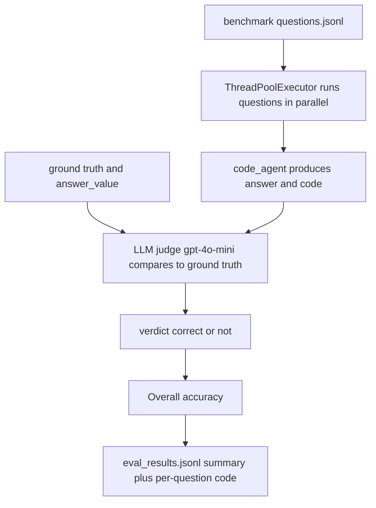

# code_agent

A tiny **NL → code → answer** agent over the 7 Abu Dhabi proptech datasets, plus a
harness that evaluates it against the benchmark.

Give it a plain-language question; an LLM writes pandas code, the code runs against the
real CSVs, and you get back the **answer**, a **grounded explanation** (built from the
values the code actually computed, so it can't be hallucinated), and the **generated code**.

## Files

| File | What it is |
|---|---|
| `code_agent.py` | the agent: `code_agent(instruction) -> {answer, explanation, code}` |
| `eval_benchmark.py` | runs the agent over the benchmark, LLM-judges each answer, reports accuracy |
| `eval_results.jsonl` | last eval output — line 1 = summary (accuracy), then one line per question incl. the generated code |

## Folder layout

This folder sits next to the data and benchmark (the code reads them via `../`):

```
cursor_hackathon/
├── .env                 # OPENAI_API_KEY  (loaded automatically)
├── data/                # the 7 CSVs
├── benchmark/           # questions.jsonl (ground truth)
└── code_agent/          # <- you are here
    ├── code_agent.py
    ├── eval_benchmark.py
    └── eval_results.jsonl
```

Paths are resolved relative to the script, so it works whether you run it from inside
`code_agent/` or from the parent. Override with `DATA_DIR`, `BENCH`, `LLM_MODEL`, etc.

## How the agent works



Key idea: the model never states a number from memory — it writes code that computes it,
and the explanation is assembled from those computed values, so the answer is auditable.

## How the eval works



The judge tolerates rounding, phrasing, and set-matching for lists, so it grades the
*answer*, not the formatting. Calls are run in parallel (the work is I/O-bound API calls)
with a per-request timeout so one stalled call can't hang the run.

## Run it

```bash
# from this folder (key auto-loads from ../.env):
python eval_benchmark.py

# knobs (all optional):
AGENT_MODEL=gpt-4o-mini WORKERS=16 python eval_benchmark.py
```

Output ends with:

```
==================================================
  ACCURACY: 73.3%   (22/30)   model = gpt-5.5
==================================================
  failed        : ['Q03', 'Q10', 'Q21', 'Q22', 'Q23', 'Q25', 'Q28', 'Q29']
```

## Results

Latest run — **`gpt-5.5`** as the agent, `gpt-4o-mini` as the judge, over all 30 questions
(full per-question detail incl. the generated code is in `eval_results.jsonl`):

| Metric | Score |
|---|---|
| **Overall accuracy** | **73.3%  (22/30)** |

Failed: `Q03, Q10, Q21, Q22, Q23, Q25, Q28, Q29`. The per-question answers and the exact
generated pandas for each are in `eval_results.jsonl`.

…and writes `eval_results.jsonl`. To use the agent directly:

```python
from code_agent import code_agent
out = code_agent("Which district has the highest gross rental yield?")
print(out["answer"], "\n", out["explanation"], "\n", out["code"])
```
